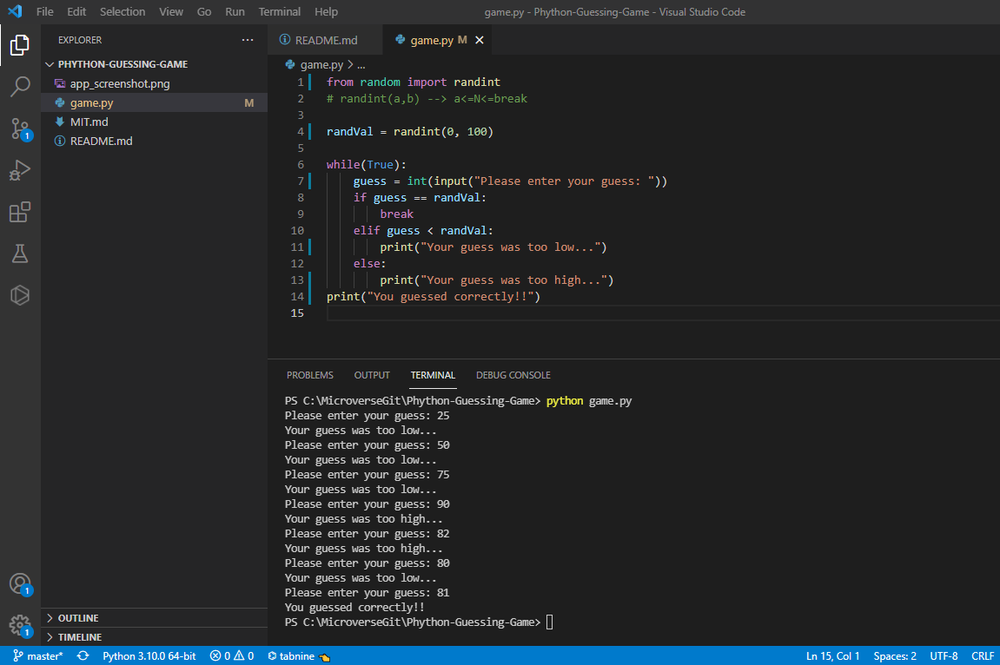

# Guessing Game

> Practice the use of the random library to get the user guess the result. 

Additional description about the project and its features.

## Built With

- Python 3.10.0
- IDLE Shell
- Git Hub

## Authors

👤 **Herbert**

- GitHub: [Herbert](https://github.com/herokudev)
- LinkedIn: [Herbert](https://www.linkedin.com/in/herbert-orellana)
- Twitter: [v](https://twitter.com/HerbertOrellan4)

## Show your support

Give a ⭐️ if you like this project!

## 📝 License

This project is [MIT](./MIT.md) licensed.
